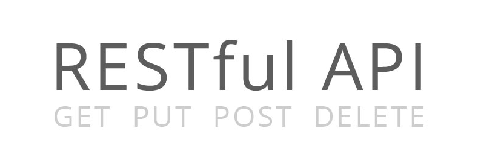
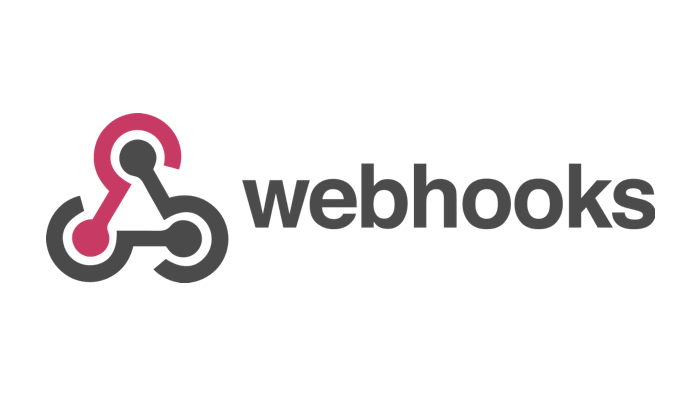

# REST, **GraphQL**, Webhooks, & gRPC
 Với tất cả sự ưa thích sự phổ biến **REST**, đôi khi chúng ta có thể quên rằng nó chỉ đơn giản
là một trong nhiều lựa chọn. **REST** là một tiêu chuẩn rất tốt cho nhiều loại API, Nhưng còn
nhiều tiêu chuẩn cho API khác mà chúng ta có thể lựa trọn cho dự án của mình.

 Để hiểu được nên sử dụng phong cách thiết kế API nào và trong tình huống nào, hãy để xem
xét **REST** trong bối cảnh của ba tùy chọn khác - **gRPC**, ****GraphQL**** và **Webhooks**. Chúng
ta sẽ cung cấp các ví dụ thực tế về **REST**, ****GraphQL****, **gRPC** và **Webhooks** trong thực 
tế và phân tích điểm mạnh và điểm yếu của họ để làm nổi bật những gì làm cho mỗi lựa chọn trở
thành một lựa chọn tốt

## REST
<div align="center"></div>

 REST có lẽ là mục phổ biến nhất được biết đến trong phần này, vì nó đã trở nên rất phổ
biến trong số các API web. **REST** là một khái niệm lần đầu tiên được định nghĩa bởi 
**Roy Fielding** trong luận án tiến sĩ vào năm 2000. Ông đã đặt nền móng cho một hệ thống kiến 
trúc được xác định bởi một loạt các ràng buộc cho web services, sử dụng một đặc điểm thiết kế 
phi trạng thái và cách tiếp cận tiêu chuẩn để xây dựng web API.

 **REST** về bản chất là không có trạng thái, và được xây dựng theo cách mà bất kỳ web services
nào tuân thủ **REST** đều có thể tương tác theo cách không trạng thái với các biểu diễn tài nguyên
dạng text. Các hoạt động này thường được xác định bằng cách sử dụng **GET**, **POST**, **PUT** và 
các phương thức HTTP khác như là một vấn đề của các tương tác được tiêu chuẩn hóa.

 Một trong những đặc tính chính của **REST** là **hypermedia** rất phong phú. Trên thực tế,
**Hypermedia** và **REST** rất phụ thuộc chặt chẽ, **Roy Fielding** đã tuyên bố rằng các API về 
mặt kỹ thuật không phải là **RESTful** nếu chúng không hỗ trợ **hypermedia**. Điều này có nghĩa 
là trong **REST API**, client và server được ghép lỏng lẻo, cho phép cả client và server cực kỳ 
tự do trong thao tác tài nguyên. Do đó, việc lặp lại nhanh chóng, nâng cấp server, độ co giãn cung
cấp tài nguyên và các yếu tố khác như vậy được cho phép và hỗ trợ.

 **REST** hỗ trợ rất nhiều, nhưng với **layered architecture**, **caching** hiệu quả và khả năng mở
rộng cao, **REST** là một giải pháp rất dễ khám phá và có tính biến đổi cao đối với vô số vấn đề
và ràng buộc. Giá trị của việc sử dụng **HTTP verbiage** được chuẩn hóa là khó có thể đánh giá
thấp, cung cấp ngữ cảnh cho người dùng cuối và chuẩn hóa hầu hết các tương tác. Tất cả đã nói,
**REST** là một giải pháp rất hiệu quả, hiệu quả và mạnh mẽ cho **API microservice** hiện đại.

### Ví dụ với PayPal
 Một ví dụ về loại API này là [**PayPal REST API**](https://developer.paypal.com/docs/api/overview/).
PayPal có chức năng kinh doanh cốt lõi mạnh mẽ - cung cấp các hệ thống tích hợp để xử lý thanh
toán. Theo đó, API của họ phải làm điều này dễ dàng. Tài nguyên phải dễ nhận dạng, các cuộc gọi 
phải được hiểu có và không có ngữ cảnh và quan trọng nhất là phải có nhiều phương tiện khác nhau
để xử lý hiệu quả một loạt các loại phương thức và phương thức thanh toán.

 Cuối cùng, API PayPal được thiết kế để dễ hiểu và dễ tích hợp. Nhìn vào ví dụ này, được lấy từ tài
liệu của họ, trong đó một cuộc gọi liệt kê một loạt các hoạt động trong API:

```
curl -v -X GET https://api.sandbox.paypal.com/v1/activities/activities?start_time=2012-01-01T00:00:01.000Z&end_time=2014-10-01T23:59:59.999Z&page_size=10 \
-H "Content-Type: application/json" \
-H "Authorization: Bearer Access-Token"
```

 Ở đây, chúng ta có thể thấy các dấu hiệu của việc triển khai **RESTful** hiệu quả. Chúng ta có thể thấy
một tiêu chuẩn HTTP verbiage trong GET method thực hiện chính xác những gì GET method nên làm - lấy tài
nguyên. URI trong trường hợp này được xác định rõ là 'activities', và cho phép chỉ giõ các ràng buộc 
yêu cầu theo time-zone và page size. Ngoài ra, kết quả của cuộc gọi này được chỉ định, application/json
là một **hypermedia-supporting format**. Đây là REST một cách ngắn gọn và là một ví dụ về trường hợp
sử dụng trong đó một hệ thống.

## gRPC
<div align="center"></div>

 Trong khi **REST** được quyết định là hiện đại, **gRPC** thực sự là một cách tiếp cận mới đối với cách 
tiếp cận cũ được gọi là **RPC** hoặc **Remote Procedure Call**. **RPC** là một phương thức để thực 
hiện một procedure trên một remote server, hơi giống với việc chạy một chương trình trên một máy tính
bạn bè cách xa workstation của bạn. Điều này có những lợi ích và nhược điểm riêng - những nhược điểm 
này là chìa khóa trong việc phát triển và triển khai **REST**, trên thực tế, bên cạnh các vấn đề khác
vốn có trong các hệ thống như **SOAP**.

 Một điểm khác biệt chính giữa **gRPC** và **REST** là cách **RPC** xác định contract negotiation.
Trong khi **REST** định nghĩa các tương tác của nó thông qua các điều khoản được tiêu chuẩn hóa trong
các requests của nó, **RPC** thực hiện theo ý tưởng về contract, trong đó việc đàm phán được xác định 
và hạn chế bởi mối quan hệ client và server thay vì chính kiến ​​trúc. **RPC** cung cấp phần lớn sức mạnh
cho client để thực thi, trong khi giảm tải phần lớn việc xử lý và tính toán cho remote server lưu trữ
tài nguyên.

 Vì lý do này, **RPC** rất phổ biến cho các thiết bị **IoT** và các giải pháp khác yêu cầu giao tiếp 
contract tùy chỉnh cho các **extremely low-power situations**. **REST** thường bị coi là đòi hỏi quá 
mức về tài nguyên, trong khi **RPC** có thể được sử dụng ngay cả trong các tình huống công suất cực
thấp. **GRPC** là một sự phát triển hơn nữa về khái niệm **RPC** và thêm một loạt các tính năng.

 Tính năng lớn nhất được thêm bởi **gRPC** là khái niệm về **protobuf**. **Protobuf** là các hệ thống
trung lập về ngôn ngữ và nền tảng được sử dụng để serialize data, có nghĩa là các giao tiếp này có thể
được serialized và truyền đạt một cách hiệu quả. Ngoài ra, **gRPC** có một authentication system rất 
hiệu quả và mạnh mẽ, sử dụng **SSL** / **TLS** thông qua Google’s token-based system. Cuối cùng, 
**gRPC** cũng là nguồn mở, có nghĩa là hệ thống có thể được audited, iterated, forked, ...

### Ví dụ Google Cloud, Bugsnag 

 Nó rất khó để chứng minh **gRPC**, theo tài liệu của **gRPC**, **gRPC** thường được sử dụng trong 
**last mile of computing**. Nói cách khác, **gRPC** thường là hệ thống cuối cùng thúc đẩy và tạo 
điều kiện giao tiếp giữa các dịch vụ khác nhau và API.

 Tuy nhiên, tài liệu **gRPC** trích dẫn rằng, do khả năng vận chuyển của nó, **gRPC** được sử dụng
trong không gian điện toán di động, cũng như hệ thống xử lý và trung gian cho dữ liệu từ 
**Google Cloud BigTable Client API**, **API Google Cloud PubSub** và **Google Cloud Speech API**. 
Điều này có ý nghĩa, vì việc sử dụng các cơ chế vận chuyển tiêu chuẩn và tải dữ liệu tương đối 
nhanh mà **gRPC** cung cấp có thể được sử dụng tốt nhất cho stream, active và repetitive communications.

 Một ví dụ khác về **gRPC** trong sản xuất có thể được tìm thấy với **Bugsnag**, một dịch vụ giám 
sát độ ổn định. Nhóm kỹ sư **Bugsnag** đã tìm thấy quy trình thiết kế ban đầu mượt mà hơn so với 
việc xây dựng **RESTfully**. Cuối cùng, tuy nhiên, họ phát hiện ra rằng rào cản đối với việc phát
triển và test **gRPC** là khá cao, do thiếu hướng dẫn và thực hành. Nhìn chung, việc cải thiện 
độ trễ và giảm chi phí vận chuyển khiến việc sử dụng **gRPC** trở thành một thành công lớn cho 
**Bugsnag**.

## **GraphQL**
<div align="center"></div>

 Cách tiếp cận ****GraphQL**** là một ý tưởng mối quan hệ giữu client và server là duy nhất trong số các
tùy chọn này và có phần đảo ngược mối quan hệ truyền thống. Với **GraphQL**, client xác định 
data họ muốn, cách họ muốn và theo định dạng họ muốn. Đây là sự đảo ngược của classic dictation
từ server sang client và cho phép nhiều chức năng mở rộng. ****GraphQL**** khác biệt hoàn toàn so 
với **REST**, trong đó contract được điều chỉnh bới client và server nhưng phần lớn được xác 
định bởi chính các resources

 Cần lưu ý rằng một lợi ích to lớn của **GraphQL** là theo mặc định, nó thường cung cấp request 
nhỏ nhất có thể. Mặt khác, **REST** thường gửi mọi thứ mà nó có cùng một lúc - request đầy đủ 
nhất, nói cách khác. Do đó, **GraphQL** có thể hữu ích hơn trong các trường hợp sử dụng cụ thể 
trong đó loại dữ liệu cần thiết được xác định rõ và data có lưu lượng thấp được ưu tiên.

### Ví dụ API-Github

 Một ví dụ về việc sử dụng **GraphQL** có thể được tìm thấy trong API **GraphQL** API GitHub. Mặc dù 
API RESTful ban đầu rất mạnh và đã làm những gì được yêu cầu, team GitHub nhận thấy API REST 
không linh hoạt. Phát biểu về vấn đề này, nhóm nghiên cứu cho biết, API phản hồi đồng thời gửi
quá nhiều dữ liệu và không bao gồm dữ liệu mà người tiêu dùng cần, đó là điểm kinh điển gây ra
sự phát triển của **GraphQL** ngay từ đầu.

 Theo đó, GitHub cần một cách để cung cấp nội dung của họ cho người yêu cầu mà không yêu cầu nhiều
cuộc gọi phức tạp, khác biệt. Họ cần cho phép người dùng điều chỉnh các yêu cầu của họ, nêu chính
xác những gì họ cần. Và quan trọng nhất, họ cần API vẫn có khả năng xử lý các yêu cầu cơ bản mà 
phần lớn API REST của họ đã xử lý hiệu quả. Cuối cùng, Github đã thêm hỗ trợ cho **GraphQL**, cung cấp
các chức năng chính này.

## Webhooks
<div align="center"></div>

 Mặc dù **GraphQL** là một tùy chọn để mở rộng API và gRPC là công cụ tái tạo theo cách tiếp 
cận classical, Webhooks là một cách tiếp cận hoàn toàn khác để cung cấp tài nguyên so với mọi 
thứ được thảo luận ở đây. Một Webhook tương đối đơn giản - nói một cách đơn giản, đó là một 
POST HTTP được kích hoạt khi có sự kiện xảy ra.

 Đây là một sự đảo ngược của classic client-server relationship - theo cách tiếp cận classic,
client request data từ server và sau đó server sẽ cung cấp data đó cho client. Theo mô hình 
Webhook, server cập nhật tài nguyên được cung cấp và sau đó tự động gửi đến client dưới dạng 
một update. Server push data. Qua đó, Client không trở thành người request, mà là người nhận
thụ động.

 Cuối cùng, sự đảo ngược này có thể được sử dụng để tạo điều kiện thuận lợi cho nhiều giao 
tiếp, nếu không sẽ yêu cầu các request phức tạp hơn và polling liên tục trên remote server.
Bằng cách đơn giản nhận tài nguyên mà không yêu cầu trực tiếp, bạn có thể cập nhật thao tác từ 
xa, phân phối tài nguyên dễ dàng và thậm chí tích hợp vào các hệ thống hiện có để cập nhật 
endpoints và dữ liệu khác liên quan đến API.

### Ví dụ 

 Webhooks là một service tương đối đơn giản và hiệu quả, và do đó, việc thực hiện chúng cũng 
đơn giản và hiệu quả không kém. Phương pháp sử dụng webhook của **AliExpress** về cơ bản là một
luồng mà người dùng 'checks in', trong đó, thúc đẩy một webhook push nội dung được cập nhật 
sang các hệ thống khác. Theo cách này, người dùng có thể tương tác trực tiếp với vị trí mà họ
đang truy cập trong khi cảnh báo cho người khác về bản chất của mối quan hệ của họ với vị trí 
thông qua sự tương tự tài nguyên khách hàng.

 Khi bạn tiếp tục tương tác với webhooks, bạn sẽ thường thấy các tích hợp phức tạp hơn. 
Ví dụ, SendGrid sử dụng webhooks để gửi cập nhật dữ liệu sự kiện cho khách hàng đăng ký, 
cảnh báo họ thay đổi đối với một số lượng lớn các biến. SendGrid thậm chí còn thực hiện 
một phương pháp hybridized webhook để phân tích email!.

## So sánh các trường hợp sử dụng REST, GraphQL, Webhooks, gRPC

 Như bạn có thể thấy, không có tùy chọn nào trong số này thực sự tốt hơn so với các tùy 
chọn khác, mà thay vào đó phù hợp với những bối cảnh nào. Chúng ta có thể tóm tắt các trường
hợp sử dụng như sau:

1. **REST**: Một stateless architecture để truyền data phụ thuộc vào **hypermedia**. **REST**
có thể liên kết nhiều loại tài nguyên có thể được request ở nhiều định dạng cho các mục đích
khác nhau. **REST** về cơ bản liên quan đến quản lý stateless resource, do đó, nó được sử dụng
tốt nhất trong các tình huống như vậy. Các hệ thống yêu cầu lặp nhanh và xác thực HTTP được
tiêu chuẩn hóa sẽ tìm thấy **REST** phù hợp nhất cho mục đích của chúng.

2. **GRPC**: Một hệ thống lightweight để yêu cầu data. **GRPC**, mặt khác, được sử dụng tốt 
nhất khi một hệ thống yêu cầu một lượng data được thiết lập hoặc xử lý thường xuyên, và 
trong đó người request là low power or resource-jealous. IoT là một ví dụ tuyệt vời về điều
này.

3. **GraphQL**: Cách tiếp cận trong đó Client xác định data và data format đó. **GraphQL** 
đến từ Facebook thể hiện tốt trường hợp sử dụng của hỗ trợ của nó, các tình huống trong đó
người request cần data theo định dạng cụ thể cho một mục đích sử dụng cụ thể. Trong những
trường hợp đó, các định dạng data và mối quan hệ giữa chúng là cực kỳ quan trọng và không
có giải pháp nào khác cung cấp cùng mức cung cấp data được kết nối với nhau.

4. **Webhooks**: Cập nhật dữ liệu sẽ được phục vụ tự động, thay vì được yêu cầu. Cuối cùng,
Webhooks được sử dụng tốt nhất khi API được đề cập chủ yếu để POST data khi có sự kiện tới client
. Mặc dù các API như vậy cũng có thể có các chức năng khác, ngay cả các API RESTful, việc sử
dụng chính của **microservice Webhook** sẽ là cập nhật client và cung cấp data được cập nhật 
mới nhât, được cung cấp khi tạo tài nguyên mới, cập nhật tài nguyên.

 Lựa chọn trong số các tùy chọn cụ thể này thực sự là vấn đề sắp xếp các chức năng của bạn 
với phương pháp phù hợp và đảm bảo rằng các hệ thống đáp ứng được sự mong đợi của bạn.