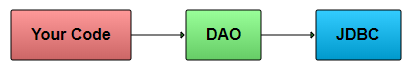
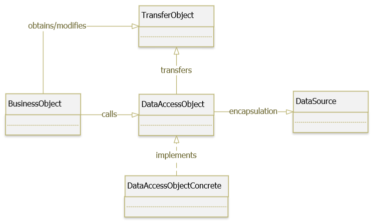
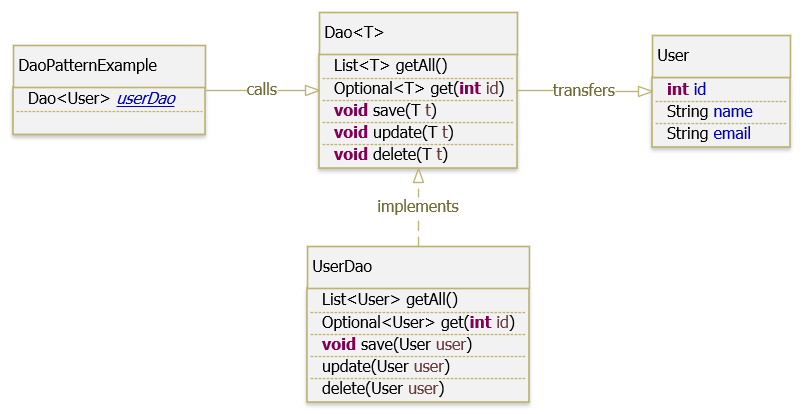

# DAO pattern.

 Một trong những khía cạnh quan trọng của **business layer** là **data access layer** để kết
nối các service với database. Việc truy cập dữ liệu tùy thuộc vào nguồn dữ liệu, loại
lưu trữ như database, text file, xml file, json file, …Thậm chí nó khác với cách triển khai 
của nó, ví dụ: cú pháp truy vấn SQL khác nhau giữa MySQL, SQL Server, Oracle, … Với mong muốn
sẽ không có gì khác biệt khi truy cập RDBMS, phân tích xml file hay bất kỳ nguồn dữ liệu nào
khác, chúng ta có thể áp dụng Data Access Object Pattern– DAO Pattern.

## DAO Pattern là gì?

 Data Access Object(DAO) Pattern là một trong những Pattern thuộc nhóm cấu trúc (Structural 
Pattern). DAO được sử dụng để phân tách logic lưu trữ dữ liệu trong một layer riêng biệt.
Theo cách này, các service được che dấu cách các hoạt động cấp thấp để truy database được thực
hiện. Nó còn được gọi là nguyên tắc Tách logic (Separation of Logic).

 Ý tưởng là thay vì có logic giao tiếp trực tiếp với cơ sở dữ l iệu, hệ thống file, web service
hoặc bất kỳ cơ chế lưu trữ nào mà ứng dụng cần sử dụng, chúng ta sẽ để logic này sẽ giao tiếp 
với lớp trung gian DAO. Lớp DAO này sau đó giao tiếp với hệ thống lưu trữ, hệ quản trị CSDL 
như thực hiện các công việc liên quan đến lưu trữ và truy vấn dữ liệu (tìm kiếm, thêm, xóa, 
sửa,…).

<div align="center">

</div>

 DAO Pattern dựa trên các nguyên tắc thiết kế abstraction và encapsulation. Nó bảo vệ phần còn 
lại của ứng dụng khỏi mọi thay đổi trong lớp lưu trữ, ví dụ: thay đổi database từ Oracle sang 
MySQL, thay đổi công nghệ lưu trữ từ file sang database.

 Trong Java, DAO được triển khai theo nhiều cách khác nhau như **Java Persistence API**,  
**Enterprise Java Bean (EJP)**, **Object-relational mapping (ORM)** với các implement cụ thể như 
**Hibernate**, **iBATIS**, **Spring JPA**, … Chi tiết về các phần này chúng ta sẽ cùng thảo luận ở một bài viết khác.

## Implement DAO Pattern như thế nào?

<div align="center">

</div>

Các thành phần tham gia Data Access Object (DAO) Pattern:

* **BusinessObject** : đại diện cho Client, yêu cầu truy cập vào nguồn dữ liệu để lấy và lưu
trữ dữ liệu.
* **DataAccessObject (DAO)**: là một interface định nghĩa các phương thức trừu tượng việc
triển khai truy cập dữ liệu cơ bản cho BusinessObject để cho phép truy cập vào nguồn dữ liệu 
(DataSource).
* **DataAccessObjectConcrete** : implement các method được định nghĩa trong DAO, lớp này sẽ 
thao tác trực tiếp với nguồn dữ liệu (DataSource).
* **DataSource** : là nơi chứa dữ liệu, nó có thể là database, xml, json, text file,
webservice, …
* **TransferObject** : là một POJO (Plain old Java object) object, chứa các phương thức 
get/set được sử dụng để lưu trữ dữ liệu và được sử dụng trong DAO class.

### Ví dụ sử dụng DAO Pattern.

 Ví dụ bên dưới cho chúng ta thấy cách áp dụng DAO Pattern trong việc cung cấp interface chung 
để thao tác với cơ sở dữ liệu (CRUD). Các thao tác này bao gồm: Create/ Save, Read/ Get, 
Update, Delete.

<div align="center">

</div>

**User.java**

```
package com.exmaple.patterns.structural.dao;
 
import lombok.AllArgsConstructor;
import lombok.Data;
 
@Data
@AllArgsConstructor
public class User {
     
    private int id;
     
    private String name;
     
    private String email;
}
```

**Dao.java**
```
package com.exmaple.patterns.structural.dao;
 
import java.util.List;
import java.util.Optional;
 
public interface Dao<T> {
 
    List<T> getAll();
 
    Optional<T> get(int id);
 
    void save(T t);
 
    void update(T t);
 
    void delete(T t);
}
```

**UserDao.java**
```
package com.exmaple.patterns.structural.dao;
 
import java.util.ArrayList;
import java.util.List;
import java.util.Optional;
 
public class UserDao implements Dao<User> {
 
    private List<User> users = new ArrayList<>();
 
    public UserDao() {
        users.add(new User(1, "GP Coder", "contact@gpcoder.com"));
        users.add(new User(2, "Giang Phan", "gpcodervn@gmail.com"));
    }
 
    @Override
    public List<User> getAll() {
        return users;
    }
 
    @Override
    public Optional<User> get(int id) {
        return users.stream().filter(u -> u.getId() == id).findFirst();
    }
 
    @Override
    public void save(User user) {
        users.add(user);
    }
 
    @Override
    public void update(User user) {
        get(user.getId()).ifPresent(existUser -> {
            existUser.setName(user.getName());
            existUser.setEmail(user.getEmail());
        });
    }
 
    @Override
    public void delete(User user) {
        get(user.getId()).ifPresent(existUser -> users.remove(existUser));
    }
}
```

**DaoPatternExample.java**
```
package com.exmaple.patterns.structural.dao;
 
public class DaoPatternExample {
 
    private static Dao<User> userDao;
 
    public static void main(String[] args) {
        userDao = new UserDao();
 
        User user1 = userDao.get(1).get();
        System.out.println("user1: " + user1);
         
        user1.setName("updated." + user1.getName());
        userDao.update(user1);
         
        System.out.println("All users: ");
        userDao.getAll().forEach(user -> System.out.println(user));
    }
}
```

**User.java**

```
user1: User(id=1, name=GP Coder, email=contact@gpcoder.com)
All users: 
User(id=1, name=updated.GP Coder, email=contact@gpcoder.com)
User(id=2, name=Giang Phan, email=gpcodervn@gmail.com)
```

## Lợi ích của DAO Pattern là gì?

* Giảm sự kết nối (loose coupling) giữa Business logic và Persistence.
* DAO cho phép đóng gói code để thực hiện thao tác CRUD, ngăn chặn việc implement riêng lẻ 
trong từng phần khác nhau của ứng dụng.
* Dễ mở rộng, bảo trì: tất cả các chi tiết lưu trữ được ẩn khỏi phần còn lại của ứng dụng. Do đó, những thay đổi có thể được thực hiện bằng cách chỉ sửa đổi một implement của DAO trong khi phần còn lại của ứng dụng không bị ảnh hưởng. DAO hoạt động như một trung gian giữa ứng dụng và cơ sở dữ liệu.
* Dễ hiểu: mọi người đều theo một quy chuẩn đã được định sẵn, nên dễ hiểu hơn, tiết kiệm được nhiều thời gian hơn.
* Trong một dự án lớn hơn, các nhóm khác nhau làm việc trên các phần khác nhau của ứng dụng, mẫu DAO cho phép phân tách rõ ràng các thành phần này.

## Sử dụng DAO Pattern khi nào?

* Khi muốn thay đổi nguồn dữ liệu sau này, như chuyển từ cơ dữ liệu MySQL sang Oracle, SQL Server, …
* Khi muốn phân tách rõ ràng các thành phần của ứng dụng.