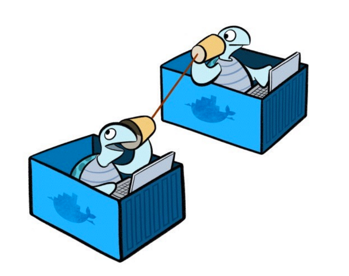
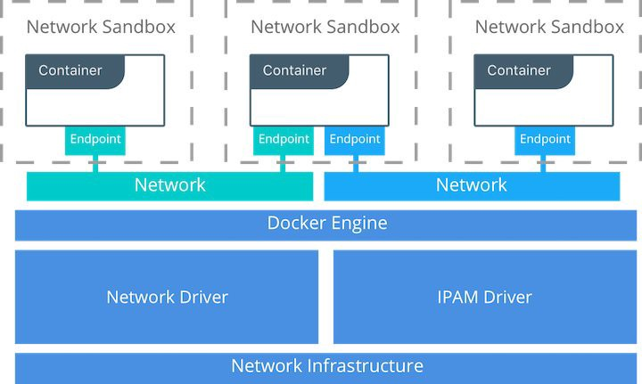
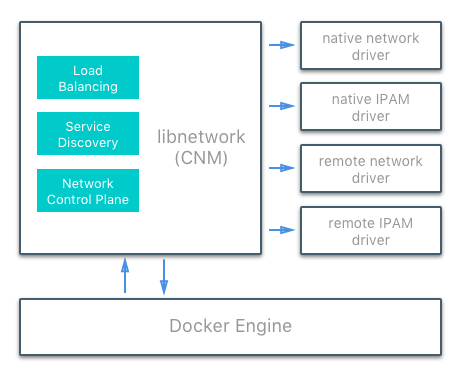
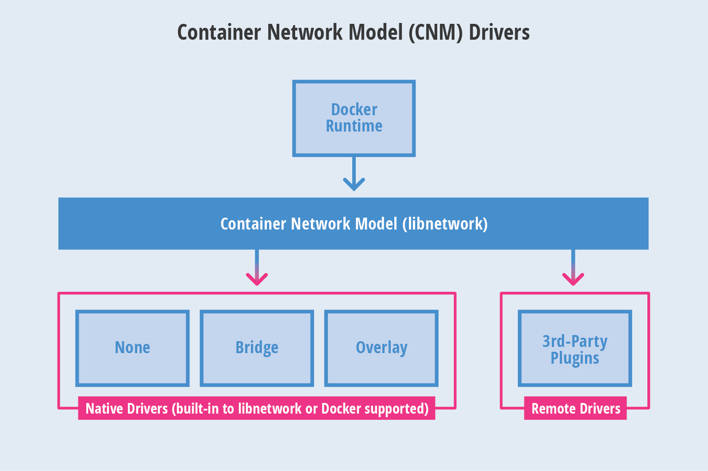
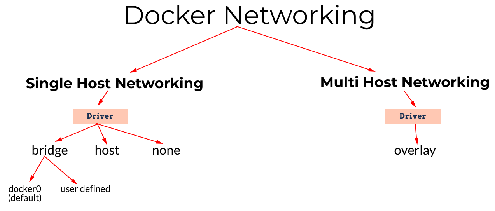

# Docker Networking

 Như đã biết việc container bao bọc application với filesystem hoàn chỉnh chứa mọi thứ cần cho việc 
run: code, runtime, system tools, system libraries, bất cứ thứ gì có thể được cài đặt trên server.

 Điều này sẽ đảm bảo việc application luôn chạy như nhau trên mọi môi trường khác nhau. Các container 
này sẽ được tách biệt với nhau và tách biệt với cơ sở hạ tầng bên dưới. Đồng thời được cung cấp thêm 
một lớp bảo vệ cho application.

 Vậy làm thế nào các container này có thể kết nối được với nhau trên cùng một host hoặc nhiều 
host ? Đó chính là việc sử dụng Networking trong Docker.

**Mô hình Container Networking**

<b>CONTAINER NETWORKING MODEL (CNM)</b>

* **Sandbox**: chứa các config của một container network stack. Điều này bao gồm việc quản lý container 
interface, bảng định tuyến (routing table) và cài đặt DNS. Việc triển khai Sandbox có thể trên không 
gian mạng Linux, một FreeBSD Jail,… Sandbox có thể có nhiều endpoint vào từ nhiều network.

* **Endpoint**: kết nối giữa Sandbox với network

* **Network**: là tập hợp các endpoint và chúng được kết nối với nhau. implement của network có thể 
là Linux bridge, VLAN,…

Container Network Model (CNM) cung cấp cho ta hai kiểu interface để có thể nối và mở nhằm thêm chức 
năng, hiển thị hoặc kiểm soát network.

**1. Network Drivers:** Docker Network Drivers cung cấp implement giúp cho network hoạt động. Nhiều 
Network Drivers có thể được sử dụng đồng thời trên Docker Engine hoặc Cluster cụ thể. Nhưng chỉ có 
thể khởi tạo thông qua một Network Drivers duy nhất. Và chúng được chia làm hai loại :

* **Native Drivers:** là phần native của Docker Engine và được cung cấp bởi Docker.

* **Remote Drivers:** được tạo bởi cộng đồng và các nhà cung cấp khác. Drivers này có thể được sử 
dụng để cung cấp tích hợp với phần mềm và phần cứng đương nhiệm. Người dùng cũng có thể tạo drivers 
riêng trong trường hợp họ muốn chức năng cụ thể mà drivers hiện tại không hỗ trợ.

**2. IPAM Drivers:** là **drivers** quản lý địa chỉ IP gốc cung cấp subnet hoặc địa chỉ IP mặc 
định cho network và endpoint. Địa chỉ IP cũng có thể được gán thủ công thông qua các lệnh tạo 
network, container và service. IPAM Drivers cũng tồn tại và cung cấp tích hợp cho các công cụ 
IPAM hiện có.

### **Các kiểu Native Driver của Docker Networking**

* **bridge:** Các bridge driver tạo một Linux bridge trên host và được quản lý bởi Docker. Theo 
mặc định các container trên một bridge có thể giao tiếp với nhau. Truy cập bên ngoài vào container 
cũng có thể được cấu hình thông qua bridge driver. Người dùng có thể tự định nghĩa trong lúc tạo 
ra networking. Ngược lại sẽ mặc định là **docker0**

* **host:** một container sử dụng network stack của host và không có sự phân tách namespace. Các 
container có thể sử dụng tất cả các interface trên host.

* **none**: **none driver** cung cấp cho một container networking stack và không gian mạng riêng 
của nó nhưng không config các interface bên trong container. Không có config bổ sung, các container 
hoàn toàn cách ly với networking stack của host.

* **overlay:** Tạo một overlay network hỗ trợ các mạng nhiều máy chủ(host). Sử dụng kết hợp các 
Linux bridge local và VXLAN để overlay các giao tiếp giữa container sang container trên cơ sở 
hạ tầng mạng vật lý (physical network infrastructure).
