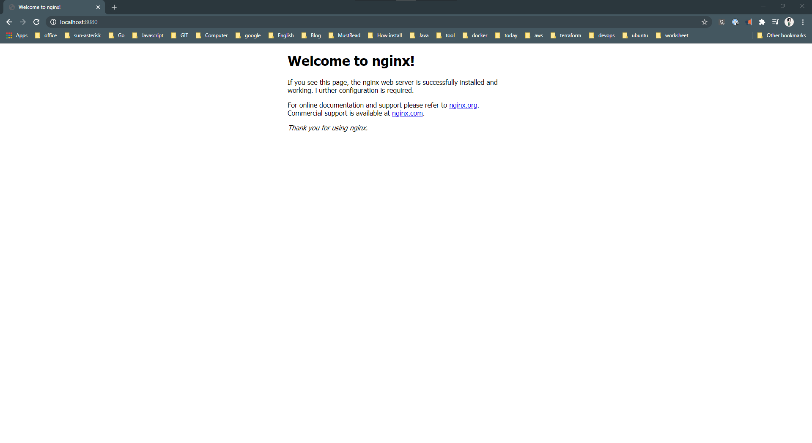

# Sử dụng official NGINX docker image

<div align="center">

</div>

 **NGINX** là một trong những web servers phổ biến nhất trên thế giới. **NGINX** không chỉ là
một static web server nhanh và đáng tin cậy, nó còn được rất nhiều developers sử dụng như một
reverse-proxy đặt trước các API của họ.

Trong hướng dẫn này, chúng ta sẽ xem xét **NGINX Official Docker Image** và cách sử dụng nó.
Chúng ta sẽ bắt đầu bằng cách chạy static web server, sau đó chúng ta sẽ build một custom
image để chứa web server của chúng ta và các files mà nó cần để sử dụng. Chúng ta sẽ kết thúc
bằng cách xem xét cách tạo reverse-proxy server cho API REST đơn giản và sau đó là cách chia sẻ image.

## Yêu cầu

 Để hoàm thành bài hướng dẫn này, chúng ta cần nhưng điều dưới đây

 * Docker account
    - [Sign up Docker account](https://hub.docker.com/)
 * Docker running locally 
    - [download and install](https://docs.docker.com/desktop/)
 * Một IDE or text editor để edit file 
    - VD: [VSCode](https://code.visualstudio.com/Download)

## NGINX Official Image

 **Docker Official Images** là một tập hợp các Docker repositories được lưu trữ trên Docker 
Hub đã được quét các lỗ hổng bảo mật và được duy trì bởi các Docker employees và upstream
maintainers.

**Official Images** là một nơi tuyệt vời để người dùng Docker mới bắt đầu. Những images này
có tài liệu rõ ràng, quảng bá các phương pháp hay nhất và được thiết kế cho các trường hợp 
sử dụng phổ biến nhất.

 Hãy cùng xem qua [NGINX official image](https://hub.docker.com/_/nginx). Mở trình duyệt yêu
thích của bạn và đăng nhập vào Docker. Nếu bạn chưa có tài khoản Docker, bạn có thể tạo một tài khoản miễn phí.

 Khi bạn đã đăng nhập vào Docker, hãy nhập “NGINX” vào thanh tìm kiếm trên cùng và nhấn 
enter. Official NGINX image phải là image đầu tiên trong kết quả tìm kiếm. Bạn sẽ thấy 
“OFFICIAL IMAGE” label ở góc trên cùng bên phải của mục tìm kiếm.

<div align="center">

</div>

 Trên màn hình chi tiết image, bạn có thể xem mô tả của image và readme của nó. Bạn cũng có
thể xem tất cả các Tags có sẵn bằng cách nhấp vào tab "Tags"

<div align="center">

</div>

## Chạy một web server cơ bản

 Hãy chạy một web server cơ bản bằng official NGINX image. Chạy lệnh sau để bắt đầu container.

```
$ docker run -it --rm -d -p 8080:80 --name web nginx
```

 Với lệnh trên, bạn bắt đầu chạy container dưới dạng daemon (`-d`) và published port 8080 trên
host. Bạn cũng đặt tên cho container web bằng cách sử dụng tùy chọn `--name`.

Mở browser yêu thích của bạn và điều hướng đến [http://localhost:8080](http://localhost:8080)
Bạn sẽ thấy NGINX welcome page.

<div align="center">

</div>

 Điều này thật tuyệt nhưng mục đích của việc chạy web server là phục vụ các tệp custom html
của riêng chúng ta chứ không phải NGINX welcome page mặc định.

 Hãy dừng container và xem xét việc phân phát các tệp HTML của riêng chúng ta.

```
$ docker stop web
```

## Thêm custom HTML
 Theo mặc định, Nginx tìm trong directory  `/usr/share/nginx/html` bên trong container để phân
phát tệp. Chúng ta cần đưa các files html của chúng ta vào thư mục này. Một cách khá đơn giản
để làm điều này là sử dụng một mounted volume. Với mounted volumes, chúng ta có thể liên kết
một diretory trên local machine của mình và map directory đó vào container đang chạy của 
chúng ta.

 Hãy tạo một trang html và sau đó phân phát trang đó bằng cách sử dụng nginx image.

Tạo một directory có tên site-content. Trong directory này, hãy thêm file index.html và thêm
html sau vào nó:

```
<!doctype html>
<html lang="en">
<head>
  <meta charset="utf-8">
  <title>Docker Nginx</title>
</head>
<body>
  <h2>Hello from Nginx container</h2>
</body>
</html>
```

 Bây giờ, hãy chạy lệnh sau, lệnh này giống như lệnh trên, nhưng bây giờ chúng ta đã thêm flag
`-v` để tạo [bind mount volume](https://docs.docker.com/storage/bind-mounts/). Thao tác này sẽ
mount local directory `/site-content` của chúng ta vào container đang chạy tại: `/usr/share/nginx/html`

```
$ docker run -it --rm -d -p 8080:80 --name web -v ~/site-content:/usr/share/nginx/html nginx
```

## Build Custom NGINX Image

 Bind mounts là một lựa chọn tuyệt vời để chạy locally và chia sẻ files vào một container đang
chạy. Nhưng nếu chúng ta muốn di chuyển image này và di chuyển các files html của chúng ta cùng với nó?

 Có một số tùy chọn có sẵn nhưng một trong những cách dễ dàng và đơn giản nhất để thực hiện
việc này là sao chép các files html của chúng tôi vào image bằng cách build một custom image.

 Để tạo một custom image, chúng ta sẽ cần tạo Dockerfile và thêm các lệnh của chúng ta vào đó.

Trong cùng một directory, hãy tạo một file có tên Dockerfile và paste các lệnh bên dưới.

```
FROM nginx:latest
COPY ./index.html /usr/share/nginx/html/index.html
```

Chúng ta bắt đầu build custom image của mình bằng cách sử dụng base image. Trên lime 1, bạn có
thể thấy chúng tq thực hiện việc này bằng lệnh `FROM`. Thao tác này sẽ pull `nginx:latest`
image vào local machine của chúng ta và sau đó build custom image của chúng ta trên đó.

 Tiếp theo, chúng ta [COPY](https://docs.docker.com/engine/reference/builder/#copy) file 
index.html của mình vào directory `/usr/share/nginx/html` bên trong container ghi đè lên file
index.html mặc định được cung cấp bởi `nginx:latest` image.

 Bạn sẽ nhận thấy rằng chúng ta đã không thêm `ENTRYPOINT` hoặc `CMD` vào Dockerfile của mình.
Chúng ta sẽ sử dụng `ENTRYPOINT` và `CMD` cơ bản được cung cấp bởi base NGINX image.

 Để build image của chúng ta, hãy chạy lệnh sau:

 ```
 $ docker build -t webserver .
 ```

Lệnh build sẽ yêu cầu Docker thực thi các lệnh nằm trong Dockerfile của chúng ta. Bạn sẽ 
thấy một đầu ra tương tự trong terminal của mình như dưới đây:

<div align="center">

</div>

 Bây giờ chúng ta có thể chạy image của mình trong một contaiber nhưng lần này chúng ta không
phải tạo một bind mount để bao gồm html của chúng ta.

```
$ docker run -it --rm -d -p 8080:80 --name web webserver
```

 Mở browser của bạn và điều hướng đến [http://localhost:8080](http://localhost:8080) để đảm
bảo rằng trang html của chúng ta đang được cung cấp chính xác.

## Thiết lậo một reverse proxy server

 Một kịch bản rất phổ biến đối với các developer là chạy các API REST của họ sau một reverse
proxy. Có nhiều lý do khiến bạn muốn làm điều này nhưng một trong những lý do chính là chạy
API server của bạn trên một network hoặc IP khác khi ứng dụng front-end của bạn được bật. 
Sau đó, bạn có thể bảo mật mạng này và chỉ cho phép lưu lượng truy cập từ reverse proxy server.

Vì mục đích đơn giản và không gian, tôi đã tạo một frontend application đơn giản bằng React.js
và một backend API giản được viết bằng Node.js.

to be continue ...