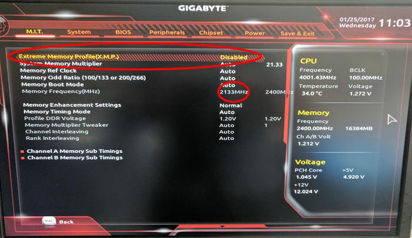

# XMP là gì

 XMP là viết tắt của Extreme Memory Profile. Đây là một công nghệ, một 
tiêu chuẩn chung do Intel phát triển để hướng đến việc nâng cao hiệu suất 
RAM một cách dễ dàng và đơn giản. Bạn có thể dùng đó để bắt thanh RAM của 
mình chạy đúng với thông số kỹ thuật được công bố thay vì mức mặc định của CPU.

## Nó hoạt động như thế nào?

 Khi bạn bật máy, BIOS / UEFI sẽ dùng một con chip trên thanh RAM gọi 
là chip SPD để căn xung nhịp và độ trễ của thanh RAM. XMP là một phần mở 
rộng của SPD, nhiệm vụ của nó là tự động tinh chỉnh để giúp thanh RAM đạt 
mức xung nhịp cao hơn, nó cũng có thể sửa các lỗi lặt vặt phát sinh trong 
quá trình tăng xung nhịp để RAM của bạn có chạy với mức xung nhà sản xuất 
công bố mà không gặp vấn đề gì.

## Không bật XMP thì có sao không?

 Tất cả RAM hiệu suất cao đều có công nghệ XMP. Chúng đều tuân theo các 
tiêu chuẩn kỹ thuật chung của ngành công nghiệp RAM DDR. Nếu bạn không bật 
XMP thì RAM sẽ chạy với mức xung nhịp hỗ trợ mặc định của CPU. Bạn sẽ không
tận dụng được hết hiệu suất của thanh RAM mà bạn đang có. XMP cho phép hệ 
thống của bạn tự thiết lập các thông số của mainboard và CPU để các thanh
RAM có thể đạt mức xung nhịp đúng với những gì mà nhà sản xuất đã công bố.

## Có bao nhiêu profile XMP?

Các thanh RAM hỗ trợ XMP trước đây có 2 profile. Cái đầu tiên cho phép bạn
ép xung thanh RAM đến mức được ghi trên bao bì. Ví dụ bạn có một thanh RAM
xung 3000MHz đang chạy ở mức 2666MHz (mức mặc định của CPU) thì profile này sẽ
cho phép bạn kéo xung RAM vượt qua cái mốc 2666 đó để đạt mức 3000MHz. Ở mức 
này thường thì máy sẽ chạy ổn định và mượt mà. Profile thứ 2 sẽ chứa những thứ 
hay ho hơn và cho phép bạn đẩy xung cao hơn nhiều, tuy nhiên nó cũng sẽ kém ổn 
định hơn. Hiện nay thì các thanh RAM đời mới thường chỉ có một profile XMP duy 
nhất cho mọi mức xung nhịp.

## Có rủi ro gì khi sử dụng XMP không?

Bật XMP không giống như việc bạn ép xung RAM lên vượt qua mức hiệu năng được 
thiết kế của nó. Các thanh RAM được gắn mác XMP đều đã được test rất kỹ. Các 
thông số như điện áp, độ trễ, xung nhịp đều đã trải qua quá trình thử nghiệm 
nghiêm ngặt trước khi đến tay người dùng nên những rủi ro như khi ép xung thủ 
công hầu hết đều đã bị loại bỏ. Nếu bạn gặp rắc rối gì đó với thanh RAM khi 
bật XMP thì bạn mang nó đi bảo hành luôn là vừa rồi đấy.

## Làm sao để bật XMP?

 Bạn có thể bật XMP từ BIOS / UEFI với các mẫu mainboard được hỗ trợ. Bạn chỉ 
cần vào đó, chọn profile XMP rồi lưu cài đặt và khởi động lại là xong.

sau khi reset

