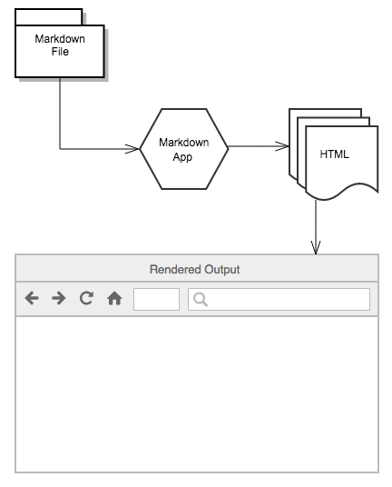

<h3 align="center">

</h3>

 <h1>Getting Started</h1> 

Tổng quan về Markdown, cách thức hoạt động và những gì bạn có thể làm với nó.

Markdown là  lightweight markup language mà có thể sự dụng để thêm các thành phần định dạng vào văn bản gốc. Được tạo
bởi John Gruber vào năm 2004, Markdown bây giờ là một markup language phổ biến nhất thế giới.

Sử dụng Markdown khác với sử dụng trình soạn thảo [WYSIWYG](https://en.wikipedia.org/wiki/WYSIWYG). Trong một application
như Microsoft Word,  bạn sửa đổi định dạng bằng cách bấm vào nút định dạng từ, nhứt shortcut và những thay đổi được hiển
thị ngay lập tức, nhưng Markdown không phải như vậy. khi tạo một tệp có định dạng Markdown, chúng ta phải thêm cú pháp 
Markdown vào văn bản để cho biết các từ và cụm từ sẽ trông khác nhau. 

Ví dụ: để biểu thị một tiêu đề, bạn thêm một ký hiệu số trước tiêu đề đó (ví dụ: # Heading One). Hoặc để đặt một cụm từ in
đậm, bạn thêm hai dấu sao trước và sau nó (ví dụ: **văn bản này được in đậm**). Có thể mất một chút thời gian để làm 
quen với việc nhìn thấy cú pháp Markdown trong văn bản của bạn, đặc biệt nếu bạn đã quen với các ứng dụng WYSIWYG. Ảnh 
chụp màn hình bên dưới hiển thị tệp Markdown được hiển thị trong trình soạn thảo văn bản hỗ trợ Markdown của các IDE của
Jetbrains.

 Bạn có thể thêm các thành phần định dạng Markdown vào tệp văn bản bằng ứng dụng soạn thảo văn bản. Hoặc bạn có thể sử 
 dụng một trong nhiều ứng dụng Markdown cho các hệ điều hành macOS, Windows, Linux, iOS và Android. Ngoài ra còn có một 
 số ứng dụng dựa trên web được thiết kế đặc biệt để viết bằng Markdown.

Tùy thuộc vào ứng dụng bạn sử dụng, bạn có thể không xem trước được tài liệu định dạng trong thời gian thực. Nhưng 
nó ổn. Theo Gruber, cú pháp Markdown được thiết kế để có thể đọc mà không cần trình bày trước, do đó, văn bản trong các tệp 
Markdown có thể được đọc ngay cả khi nó không được hiển thị.

Mục tiêu thiết kế ghi đè cho cú pháp theo định dạng Markdown, là làm cho nó dễ đọc nhất có thể. Ý tưởng là một tài liệu có 
định dạng Markdown phải được xuất bản dưới dạng, dưới dạng văn bản thuần túy, mà không trông giống như nó được đánh dấu 
bằng các thẻ hoặc hướng dẫn định dạng.

## Markdown for beginners.

Cách tốt nhất để bắt đầu với Markdown là sử dụng nó. Điều đó dễ dàng hơn bao giờ hết nhờ có nhiều công cụ miễn phí. 

Bạn không cần tải xuống bất cứ thứ gì. Có một số trình soạn thảo Markdown trực tuyến mà bạn có thể sử dụng để thử viết 
trong Markdown. [Dillinger](https://dillinger.io/),[Markdown Here](https://markdown-here.com/)... là một vài trong những 
biên tập viên Markdown trực tuyến tốt nhất. Chỉ cần mở trang web và bắt đầu gõ vào khung bên trái. Một bản xem trước của 
tài liệu được hiển thị xuất hiện trong khungbên phải.

Bạn có thể giữ cho trang web mở khi bạn đọc qua hướng dẫn này. Bằng cách đó bạn có thể thử cú pháp khi bạn tìm hiểu về 
nó. Sau khi bạn làm quen với Markdown, bạn có thể muốn sử dụng ứng dụng Markdown có thể được cài đặt trên máy tính để bàn 
hoặc thiết bị di động của bạn. bạn cũng có thể tìm hiểu syntax của Markdown [ở đây](./cheat-sheet.md)

## How Does it Work?

Khi bạn viết bằng Markdown, văn bản được lưu trữ trong tệp văn bản gốc có phần mở rộng `.md` hoặc `.markdown`. Nhưng sau đó 
thì? Tệp định dạng Markdown của bạn được chuyển đổi thành HTML hoặc tài liệu sẵn sàng in như thế nào? 

Câu trả lời ngắn gọn là bạn cần một ứng dụng Markdown có khả năng xử lý tệp Markdown. Có rất nhiều ứng dụng có sẵn - mọi 
thứ từ các tập lệnh đơn giản đến các ứng dụng trên máy tính trông giống như Microsoft Word. Mặc dù sự khác biệt 
về hình ảnh của chúng, tất cả các ứng dụng đều làm điều tương tự. Giống như Dillinger, tất cả đều chuyển đổi văn bản có 
định dạng Markdown sang HTML để có thể hiển thị trong trình duyệt web. Các ứng dụng 

Markdown sử dụng một cái gì đó gọi là Markdown processor (thường được gọi là bộ phân tích cú pháp, một bộ phân tích dữ 
liệu, một bộ cài đặt định dạng Markdown) để lấy văn bản có định dạng Markdown và xuất nó thành định dạng HTML. Tại thời 
điểm đó, tài liệu của bạn có thể được xem trong trình duyệt web. Bạn có thể thấy một đại diện trực quan của quá trình 
này dưới đây.

Chú ý: Ứng dụng và bộ xử lý Markdown là hai thành phần riêng biệt. Vì lợi ích của ngắn gọn, tôi đã kết hợp chúng 
thành một yếu tố ('Ứng dụng Markdown') trong hình bên dưới.

<h3 align="center">

</h3>

Chúng ta cũng có thể sử dụng các ứng dụng markdown để chuyển đổi nó sang nhiều định dạng khác như `PDF`

## What does markdown bring?

Markdown là một cách nhanh chóng và dễ dàng để ghi chú, tạo nội dung cho trang web và tạo tài liệu sẵn sàng in. 

Nó không mất nhiều thời gian để học cú pháp Markdown và khi bạn biết cách sử dụng nó, bạn có thể viết bằng Markdown ở 
mọi nơi. Hầu hết mọi người sử dụng Markdown để tạo nội dung cho web, nhưng Markdown rất tốt cho việc định dạng mọi thứ 
từ email đến danh sách tạp hóa. 

Đây là một số ví dụ về những gì bạn có thể làm với Markdown.

####Websites.

Markdown được thiết kế cho web, do đó, không có gì ngạc nhiên khi có rất nhiều ứng dụng được thiết kế đặc biệt để tạo 
nội dung trang web.

Nếu bạn đang tìm kiếm cách đơn giản nhất có thể để tạo một trang web với các tệp Markdown, hãy xem [blot.im](https://blot.im/)
và [smallvictori.es](https://smallvictori.es/). Sau khi bạn đăng ký một trong những dịch vụ này, họ sẽ tạo thư mục 
Dropbox trên máy tính của bạn. Chỉ cần kéo và thả các tệp Markdown của bạn vào thư mục và họ làm trên trang web của bạn. Nó 
không thể dễ dàng hơn.

Nếu bạn quen thuộc với HTML, CSS và kiểm soát phiên bản, hãy xem [Jekyll](https://jekyllrb.com/), trình tạo trang tĩnh 
phổ biến lấy tệp Markdown và xây dựng trang web HTML. Một lợi thế của phương pháp này là GitHub Pages cung cấp lưu trữ 
miễn phí cho các trang web do Jekyll tạo ra. Nếu Jekyll không phải là sự ưa thích của bạn, chỉ cần chọn một trong nhiều 
tạo trang tĩnh khác có sẵn [ở đây](https://www.staticgen.com/).

Nếu bạn thích sử dụng hệ thống quản lý nội dung (CMS) để cung cấp năng lượng cho trang web của mình, hãy xem 
[Ghost](https://ghost.org/). Nó có một nền tảng viết blog miễn phí và mã nguồn mở với trình soạn thảo Markdown đẹp. 
Nếu bạn là một người dùng WordPress, bạn sẽ rất vui khi biết có hỗ trợ Mark Markdown cho các trang web được lưu trữ 
trên WordPress.com. Các trang web WordPress tự lưu trữ có thể sử dụng [plugin Jetpack](https://jetpack.com/support/markdown/).

####Documents

Markdown không có tất cả những gì hay ho của các trình xử lý văn bản như Microsoft Word, nhưng nó đủ tốt để tạo các tài 
liệu cơ bản như bài tập và chữ cái. Bạn có thể sử dụng ứng dụng soạn thảo tài liệu Markdown để tạo và xuất các tài liệu 
được định dạng Markdown sang định dạng tệp PDF hoặc HTML. Phần PDF là chìa khóa, bởi vì một khi bạn có một tài liệu PDF, 
bạn có thể làm bất cứ điều gì với nó - in nó, gửi email hoặc tải nó lên một trang web.

Dưới đây là một số ứng dụng soạn thảo tài liệu Markdown

* `Mac`: [iA Writer](https://ia.net/writer/), [Ulysses](https://ulyssesapp.com/), [Marked](http://marked2app.com/), 
[MacDown](https://macdown.uranusjr.com/)
* `iOS / Android`: [iA Writer](https://ia.net/writer/) or [Ulysses](https://ulyssesapp.com/) `(iOS)`
* `Windows`: [MarkdownPad](http://markdownpad.com/)
* `Web`: [Dillinger](https://dillinger.io/) or [StackEdit](https://stackedit.io/)

####Notes

Trong gần như mọi cách, Markdown là cú pháp lý tưởng để ghi chú. Đáng buồn thay, Evernote và OneNote, hai trong số các 
ứng dụng ghi chú phổ biến nhất, hiện tại không hỗ trợ Markdown. Tin vui là một số ứng dụng ghi chú khác hỗ trợ Markdown:

* [Simplenote](https://simplenote.com/) là một ứng dụng ghi chú miễn phí, có sẵn cho mọi nền tảng.
* [Bear](http://www.bear-writer.com/) là một ứng dụng giống như Evernote có sẵn cho các thiết bị Mac và iOS. Theo mặc định, nó không sử dụng cú pháp 
Markdown, nhưng bạn có thể [bật chế độ tương thích Markdown](http://www.bear-writer.com/faq/Markup%20:%20Markdown/Markdown%20compatibility%20mode/).
* [Boostnote](https://boostnote.io/) như là một ứng dụng ghi chú mã nguồn mở được thiết kế cho các lập trình viên

#### Books 

Tìm cách để tự xuất bản một cuốn tiểu thuyết? Hãy thử [Leanpub](https://leanpub.com/), một dịch vụ lấy các tệp có định 
dạng Markdown của bạn và biến chúng thành một cuốn sách điện tử. Leanpub xuất sách của bạn ở định dạng tệp PDF, EPUB và 
MOBI. Nếu bạn muốn tạo các bản sao bìa mềm của cuốn sách, bạn có thể tải tệp PDF lên một dịch vụ khác như 
[Kindle Direct Publishing](https://kdp.amazon.com/). Để tìm hiểu thêm về cách viết và tự xuất bản một cuốn sách bằng 
Markdown, hãy đọc bài đăng trên [blog này](https://medium.com/techspiration-ideas-making-it-happen/how-i-wrote-and-published-my-novel-using-only-open-source-tools-5cdfbd7c00ca).

#### Presentations

Dù bạn có tin hay không, bạn có thể tạo các bài thuyết trình từ các tệp có định dạng Markdown. Tạo bản trình bày 
trong Markdown cần một chút quen thuộc, nhưng khi bạn hiểu rõ về nó, nó sẽ nhanh hơn và dễ dàng hơn nhiều so với sử dụng 
một ứng dụng như PowerPoint hoặc Keynote. [Remark](https://remarkjs.com/) ([GitHub project](https://github.com/gnab/remark)) 
là một công cụ trình chiếu Markdown dựa trên trình duyệt phổ biến, cũng như [Cleaver](http://jdan.github.io/cleaver/) 
([GitHub project](https://github.com/jdan/cleaver)). Nếu bạn sử dụng máy Mac và muốn sử dụng một ứng dụng, hãy xem 
[Deckset](https://www.decksetapp.com/) hoặc [Marked](http://marked2app.com/).

#### Email

Nếu bạn gửi rất nhiều email và bạn đã mệt mỏi với các điều khiển định dạng có sẵn trên hầu hết các trang web của nhà 
cung cấp email, bạn sẽ rất vui khi biết ở đó một cách dễ dàng để viết email bằng Markdown. 
[Markdown here](http://markdown-here.com/) đây là một phầnmở rộng trình duyệt nguồn mở và miễn phí, chuyển đổi văn bản 
có định dạng Markdown thành HTML mà sẵn sàng gửi.

#### Documentation

Markdown là một sự phù hợp cho các tài liệu kỹ thuật. Các công ty như GitHub đang ngày càng chuyển sang Markdown
cho tài liệu của họ - hãy xem bài đăng trên [blog](https://github.com/blog/1939-how-github-uses-github-to-document-github) 
của họ về cách họ di chuyển tài liệu được định dạng Markdown của họ sang [Jekyll](https://jekyllrb.com/). Nếu bạn viết 
tài liệu cho một product hoặc service, hãy xem các công cụ tiện dụng này:

* [Read the Docs](https://readthedocs.org/) có thể tạo một trang web tài liệu từ các tệp Markdown nguồn mở của bạn. 
Chỉ cần kết nối kho lưu trữ GitHub của bạn với dịch vụ của họ và push - Read the Docs làm phần còn lại. Họ cũng có một 
dịch vụ cho [thương mại](https://readthedocs.com/).

* [MkDocs](http://www.mkdocs.org/) là một trình tạo trang web static nhanh và đơn giản mà hướng tới việc xây dựng tài 
liệu dự án. Các tệp nguồn tài liệu được viết bằng Markdown và được cấu hình bằng một tệp cấu hình YAML duy nhất. 
MkDocs có một số [built in themes](http://www.mkdocs.org/user-guide/styling-your-docs/).

* [Docusaurus](https://docusaurus.io/) là một trình tạo web static được thiết kế dành riêng cho việc tạo các trang web 
tài liệu. Nó hỗ trợ dịch, tìm kiếm và phiên bản.

* [VuePress](https://vuepress.vuejs.org/) là một trình tạo trang tĩnh do [Vue](https://vuejs.org/) cung cấp và được tối 
ưu hóa để viết tài liệu kỹ thuật.

* [Jekyll](https://jekyllrb.com/) đã được đề cập trước đó trong phần trên các trang web, nhưng nó cũng là một lựa chọn 
tốt để tạo một trang web tài liệu từ các tệp Markdown.

## Helpful for you

Có rất nhiều tài nguyên bạn có thể sử dụng để học Markdown. Dưới đây là một số tài nguyên giới thiệu khác:

* [John Gruber’s Markdown documentation](John Gruber’s Markdown documentation): Hướng dẫn ban đầu được viết bởi người 
tạo ra Markdown.

* [Markdown tutorial](https://www.markdowntutorial.com/): Một trang web nguồn mở cho phép bạn dùng thử Markdown trong 
trình duyệt web của bạn.

* [Awesome Markdown](https://github.com/mundimark/awesome-markdown): Một danh sách các công cụ Markdown và tài nguyên 
học tập.

* [Cheat sheet](): Là một tổng quan nhanh những gì bạn có thể làm với markdown.